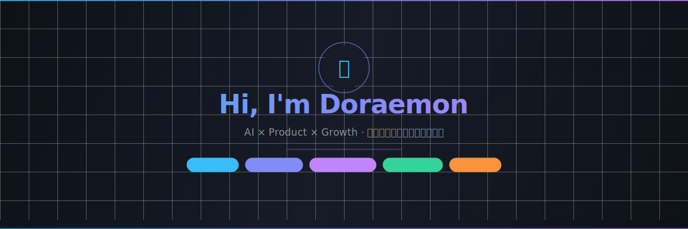

<div align="center">



<br/>

> *"用 AI 让普通人变强；用方法把复杂的事变简单；用行动把人生带到更高的位置。"*

<br/>

</div>

---

## 🧭 About Me

从零售一线运营到 AI 驱动型产品构建者。

我在北京零售市场做过门店增长，深度参与了即时零售的获客实战——亲历了那种"SOP 是墙上一张纸，员工根本执行不了"的无力感之后，我开始相信：**可运行的工具，胜过一百份培训文档。**

于是我开始用代码和 AI，把那些无人解决的效率问题，变成可以交付的产品。

```
📍 北京 · 零售增长 / 新媒体运营 → AI 产品构建
🔭 专注：AI Workflow · Prompt Engineering · 产品 0→1
💬 话题：用户增长 / SOP 自动化 / 低代码落地
```

---

## 🚀 Project Showcase

<table>
<tr>
<td width="50%" valign="top">

### 🧠 [My Brain — AI 智能收藏夹](https://github.com/YiShu5/my-bookmarks)

**高密度知识萃取器 · 解决信息过载**

> 收藏一个链接的瞬间，就是提炼知识的瞬间。

每次收藏，DeepSeek 自动阅读全文 → 生成摘要 → 结构化知识笔记 → 语义标签。你得到的不是一个死链接，而是一张随时可激活的知识卡片。

**核心能力：**
- 🤖 双通道 AI 并发：快速摘要 + 深度提炼
- 📸 Readability 全文快照，内容永不 404
- 📱 PWA + Web Share Target，手机原生体验
- 📋 剪贴板 FAB，Ctrl+V 盲狙式无感收藏

`Next.js 14` `DeepSeek` `SQLite` `PWA` `Tailwind`

</td>
<td width="50%" valign="top">

### 📈 [美评宝 — Business Growth](https://github.com/YiShu5/meipingbao)

**门店运营 SOP 自动化工具 · 实战于北京零售市场**

> 把 SOP 从文档变成工具，让每个门店员工都能执行专业级获客动作。

为零售门店打造的运营执行平台。AI 秒生成平台调性评价，覆盖抖音小时达 / 美团 / 饿了么全链路 SOP。

**核心能力：**
- ⚡ 6 大品类 × 6 种风格，2 秒生成内容
- 📚 三大即时零售平台运营方法库
- 💬 门店反馈闭环，持续迭代
- 🚀 无数据库无登录，部署即用

`Next.js 16` `DeepSeek` `Tailwind 4` `Edge Deploy`

</td>
</tr>
</table>

---

## ⚡ Tech Stack

**AI & Backend**


**Frontend & Framework**


**Product & Growth**


---

## 📊 GitHub Stats

<div align="center">


&nbsp;&nbsp;


</div>

---

## 💡 产品哲学

> *好产品应该像空气一样自然——你不会注意到它的存在，但离开它就会窒息。*

> *工具不应该制造摩擦，它应该让正确的事情变得更容易。*

> *从真实痛点出发，而不是从技术的可能性出发。*

---

<div align="center">

**行动比完美的 PPT 更有价值。**

<br/>


</div>
